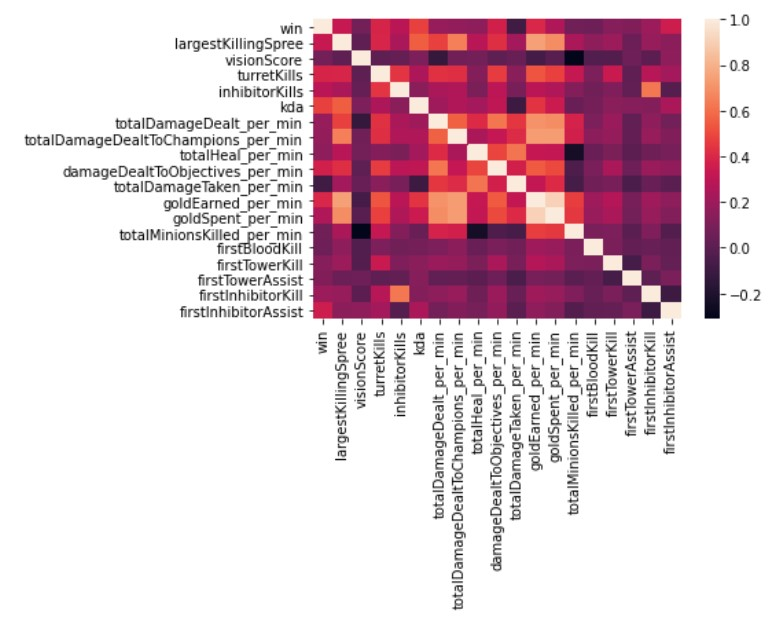
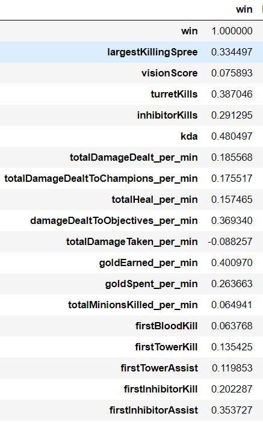
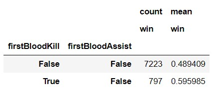
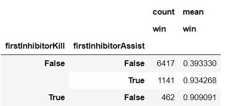
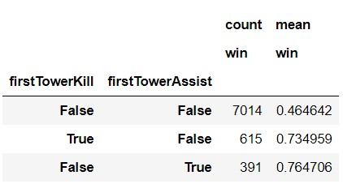
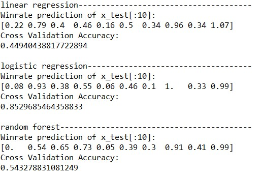

# League of Legends Winrate Estimator

Created models that predict the winrate of players with certain play style

## Data Gathering

* Used RiotAPI to gather the game data
* Get a random list of players from each game rankings
* Find a random match of each of the selected players
* Save the data for all players in each match

## Data cleaning

* Converted all missing values to <b>False</b>
* Calulated the kda (kill-death-assist) ratio
* Converted some stats to "per minute" to neutralize the data

## Exploratory Data Analysis

* Looked into the distributions and value counts of the data
* Looked into correlations of the numerical variables with winning
<div style="width=100%;display: inline-block;">
  </img>
  </img>
</div>

* Looked into the winrate of certain categorical variables
<div style="width=100%;display: inline-block;">
  </img>
  </img>
  </img>
</div>

## Model Building

I selected the variables that seem to have most influence on winning to be in my model:
```
df_model = df[['win', 'largestKillingSpree', 'visionScore', 'turretKills', 'inhibitorKills',
                   'kda', 'totalDamageDealt_per_min', 'totalDamageDealtToChampions_per_min',
                   'totalHeal_per_min', 'damageDealtToObjectives_per_min', 'totalDamageTaken_per_min',
                   'goldEarned_per_min', 'goldSpent_per_min', 'totalMinionsKilled_per_min',
                   'firstBloodKill', 'firstBloodAssist', 'firstTowerKill', 'firstTowerAssist',
                   'firstInhibitorKill', 'firstInhibitorAssist']]
```
I transformed the categorical variables into dummy variables. I also split the data into train and tests sets with a test size of 33%.

I tried three different models:

* Multiple Linear Regression - As a baseline model
* Logistic Regression - Since I am trying to predict win/lose, which is binary
* Random Forest - Because I thought it would be a good fit here

## Model Performance

From the three models, logistic regression performed the best:

</img>

## Used

* Numpy
* Pandas
* scikit-learn
* RiotAPI
